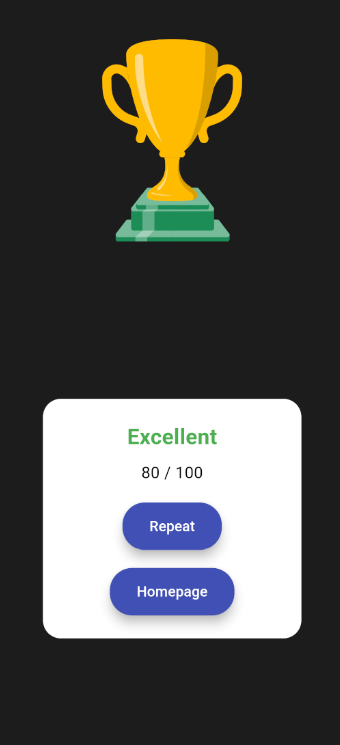

# Quiz App

A new Flutter project.

## Project Description
A simple quiz application about the four major football teams in the Turkish league.

## Screenshots
#### Screens
<div style="display: flex; justify-content: space-around; flex-wrap: wrap; text-align: center;">
    <div style="flex: 1; margin: 10px;">
        
        <div style="font-weight: bold; margin-top: 5px;">Home Screen</div>
    </div>
    <div style="flex: 1; margin: 10px;">
        
        <div style="font-weight: bold; margin-top: 5px;">Choose Screen</div>
    </div>
    <div style="flex: 1; margin: 10px;">
        
        <div style="font-weight: bold; margin-top: 5px;">Questions Screen</div>
    </div>
    <div style="flex: 1; margin: 10px;">
        
        <div style="font-weight: bold; margin-top: 5px;">Result Screen</div>
    </div>
</div>

## Resources 

- Lottie Animations: [Lottie Files](https://lottiefiles.com/)
  - To add the Lottie library to Flutter:
    Open the terminal and run:
    ```bash
    flutter pub add lottie
    ```
